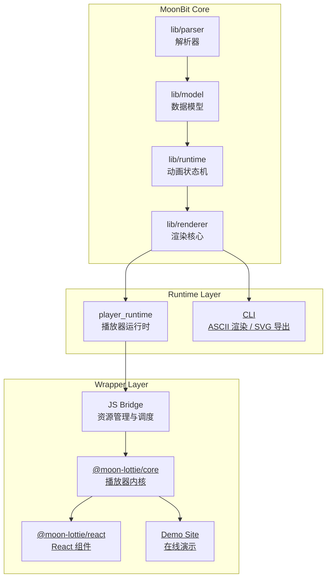

# 项目架构 (Architecture)

Moon Lottie 采用分层架构，确保核心引擎的跨平台一致性与前端封装的灵活性。

## 1. 核心分层

## 2. 职责定义

- **MoonBit Core**: 包含 [cg-zhou/moon_lottie](https://mooncakes.io/docs/cg-zhou/moon_lottie)、[cg-zhou/bezier_easing](https://mooncakes.io/docs/cg-zhou/bezier_easing) 等核心库，承担 JSON 解析、属性插值计算与跨平台渲染指令生成，另外制作了 [cg-zhou/drawille](https://mooncakes.io/docs/cg-zhou/drawille) 用于实现 ASCII 渲染。
- **Runtime Layer**: 产出不同环境的接入点：
  - 浏览器端通过 Wasm-GC 提供高性能路径。
  - 命令行通过 [CLI](https://mooncakes.io/docs/cg-zhou/moon_lottie) 提供 ASCII 渲染与 SVG 导出。
- **Wrapper Layer**: 提供 [@moon-lottie/core](https://www.npmjs.com/package/@moon-lottie/core) 与 [@moon-lottie/react](https://www.npmjs.com/package/@moon-lottie/react)，为前端开发者提供了 React 和 Web Component API，并提供了封装示例。

## 3. 设计策略

- **双运行时并存**: 同时支持 Wasm-GC（首选）与 JS Fallback，确保移动端兼容。
- **解耦设计**: 核心引擎不依赖特定框架或 DOM，可独立用于服务端或终端渲染。
- **渲染分工**: Canvas 用于高性能播放；SVG 主要用于资源导出。
