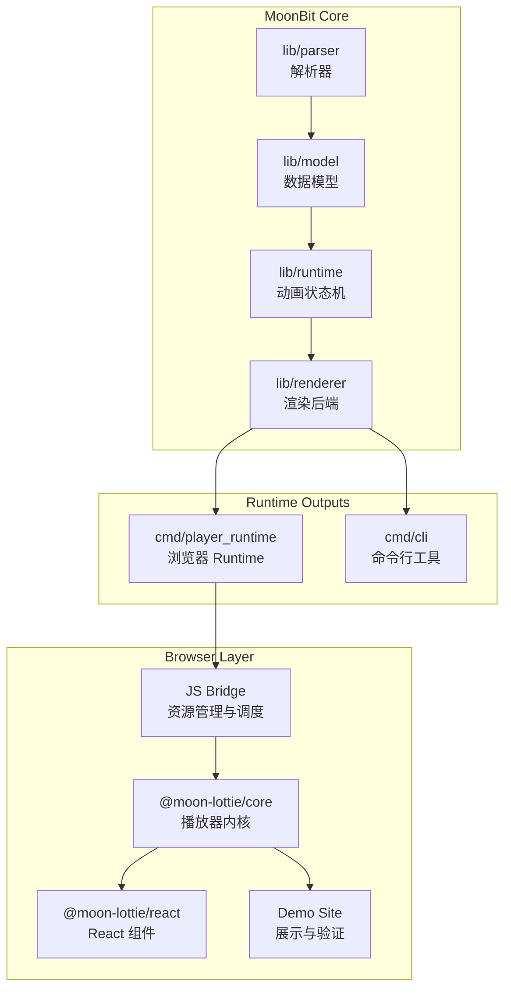

# 项目架构 (Architecture)

Moon Lottie 采用分层架构，确保核心引擎的跨平台一致性与前端封装的灵活性。

## 1. 核心分层

## 2. 职责定义

- **MoonBit Core**: 承担所有动画逻辑，包括 JSON 解析、属性插值计算与跨平台渲染指令生成。
- **Runtime Layer**: 产出不同环境的接入点。浏览器端通过 Wasm-GC 提供高性能路径；CLI 提供非 Web 场景支持。
- **Wrapper Layer**: 为前端开发者提供符合习惯的 API（如 React Hooks/Components），保持薄封装。

## 3. 设计策略

- **双运行时并存**: 同时支持 Wasm-GC（首选）与 JS Fallback，确保全环境兼容。
- **解耦设计**: 核心引擎不依赖特定框架或 DOM，可独立用于服务端或终端渲染。
- **渲染分工**: Canvas 用于高性能播放；SVG 用于资源导出与结构化验证。
