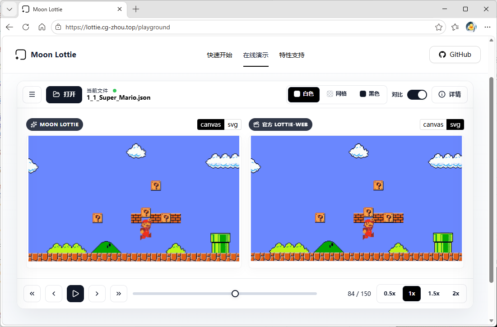
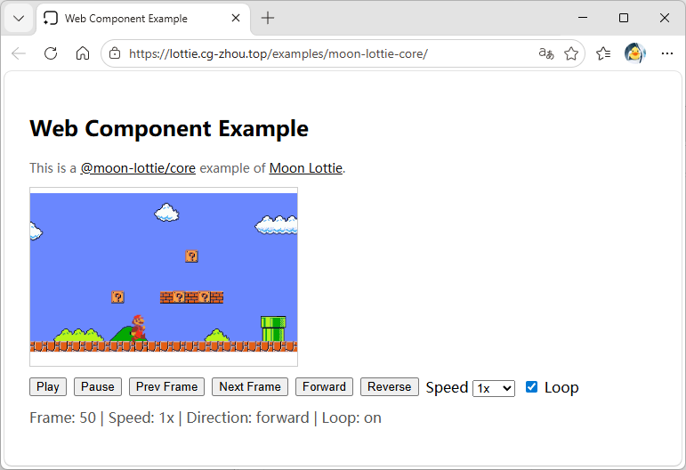
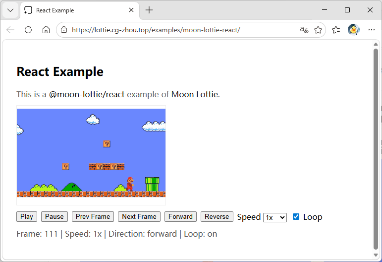
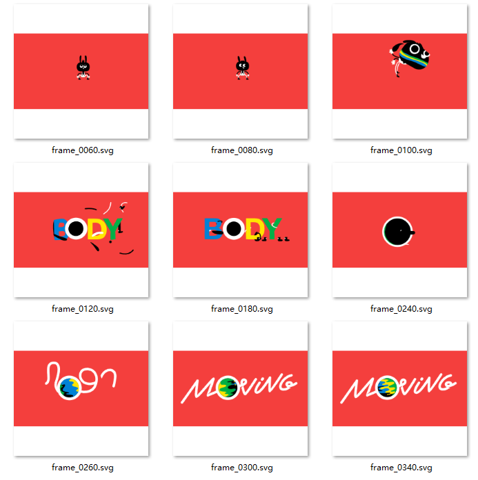

# 项目完成度

本文档对照项目申报书，快照当前 Moon Lottie 的核心交付物状态。

## 1. 交付物

| 交付名称 | 类型 | 说明 |
| --- | --- | --- |
| **[在线演示](https://lottie.cg-zhou.top)** | 网站 | 支持调速、上传、对比，实时预览渲染效果  |
| **[cg-zhou/moon_lottie](https://mooncakes.io/docs/cg-zhou/moon_lottie)** | MoonBit 包 | Moon Lottie 核心渲染引擎库 |
| **[cg-zhou/bezier_easing](https://mooncakes.io/docs/cg-zhou/bezier_easing)** | MoonBit 包 | 三次贝塞尔曲线缓动函数计算库 |
| **[cg-zhou/drawille](https://mooncakes.io/docs/cg-zhou/drawille)** | MoonBit 包 | 用于终端图形渲染的 Unicode Braille 字符库  |
| **[@moon-lottie/core](https://www.npmjs.com/package/@moon-lottie/core)** | npm 包 | 浏览器侧命令式播放器封装与 Web Component  |
| **[@moon-lottie/react](https://www.npmjs.com/package/@moon-lottie/react)** | npm 包 | 面向 React 生态的轻量化组件封装  |
| **[CLI 工具](https://mooncakes.io/docs/cg-zhou/moon_lottie)** | 命令行 | 支持 SVG 导出、CLI 的 ASCII 绘制  |

## 2. 核心功能

| 申报项 | 状态 | 说明 |
| --- | --- | --- |
| **协议解析** | 已完成 | 支持解析 Lottie 的动画 JSON |
| **几何渲染** | 已完成 | 参考 [特性列表](https://lottie.cg-zhou.top/features)
| **动画逻辑** | 已完成 | 参考 [在线演示](https://lottie.cg-zhou.top/playground) |
| **多端支持** | 已完成 | 支持 Web 渲染、SVG 导出、CLI 的 ASCII 绘制 |
| **表达式** | 网页端支持 | 前端渲染支持通过 JS 进行表达式求值 |

## 3. 验收指标

- **工程质量**: 建立 `lib` (核心), `cmd` (入口), `packages` (封装) 的明确边界。
- **稳定性**: 通过 174 条 `moon test` 核心单元测试。
- **验证手段**: 建立 80+ 样例库，并支持像素级截图回归对比工具。
